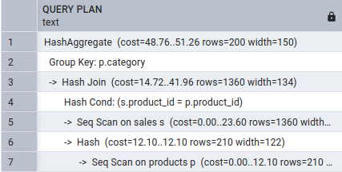
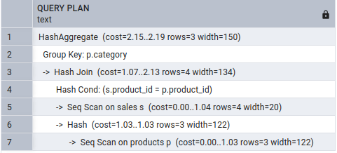

# Online_store


## Exercise 1: Denormalizing Total Sales per Order

### Pros and cons of denormalizing

The pros of denormalization, where the sum of each order is calculated and saved in a column in the Orders table, are that both the database and those writing the queries avoid time-consuming calculations every time the sum is needed for an order. By writing a function that sums up the OrderDetails and stores the result in a column, and creating a trigger to update the column whenever the OrderDetails table is updated, deleted, or inserted into, you can peform this process automatically(the SQL script for the trigger can be found in the folder "Scripts").

The cons are that it introduces redundancy as the total amount is already present in the OrderDetails table if you just calculate using the SUM() function. So adding a new column for something that already exists in another table introduces the redundancy, but because its a total calculated amount it is still not a information that directly exist in another table, and therefor its not completely a redundancy issue. Another potential risk is that if the total_amount is not updated correctly or if there is an issue with the trigger, errors could occur, which could lead to incorrect results being shown when quering the orders table. 

Also, if the total_amount is not frequently needed, introducing a new column and a trigger could result in unnecessary operations in the database, which could lead to performance overhead that are not necessary. In those cases, it might only make sense to denormalize if the total amount is something that is often queried or needed by the users. 
### 

## Exercise 2: Denormalizing Customer Data in Orders

The downsides of this approach is that we replicate a lot of redundant data into each row of the orders table.
Information about customers is written several times, making is necessary to store unnecessary data, and breaking 3NF

I could be useful for avoiding joins on other tables, but we think this gain is very minimal in comparison to the cost of introducing redundacy. The original Customers table, has become completely useless, and future updates requires updates of both the customers table, and all corresponding rows in orders.

## Exercise 3: Using Partitioning for Sales Data

The pros of using partitioning is if you have a very large table containing many rows and a lot of data. By breaking the table into smaller parts it can improve the speed of the queries and also make it more managable for those writing the queries and accessing the data. 

If you try and insert a sale for a year that doesnt have a partition you get this error :  "ERROR:  Partition key of the failing row contains (EXTRACT(year FROM sale_date)) = (2020).no partition of relation "sales" found for row". So when a new year starts you have to create a new partition for that year or else the data for that year cannot be inserted. A good idea would be to implement this automatically so you dont suddenly have a situation where data cannot be inserted. 

## Exercise 4: Using List Partitioning for Regional Data

List partitions optimizes SELECT queries. Especially with conditional checks.
To add a new region a new partition table has to be created for the new category. Future inserts will be distrbuted automatically.
It depends on what kind of queries is usually run. if the range is the most often conditioned, it makes the most sense to partion it like that.

##  Exercise 5: Checking Query Performance with Partitioning

When running `EXPLAIN` or `EXPLAIN ANALYSE` in postgreSQL, is not available, but instead shows returned and filtered rows.
It automatically decides which partition to examine, meaning there is no runtime difference between querying the "parent" table and the created partition directly.


# Query Optimization Exercises

## Notes for exercise 1 

The table shows the performance differences between the nested subquery and the join query. In this case, the subquery is actually performing better than the join query, but in scenarios involving larger datasets, a JOIN query would typically be more efficient. This is because, with a JOIN, we can reduce redundancy. With a subquery, the database may need to scan all the rows multiple times, and as the table grows in size, this can result in longer execution times compared to using a JOIN. But in this case there is only a few rows in the orders table which may be why the subquery performs better here. The JOIN query uses the customers_pkey index, which helps it perform better by scanning fewer rows compared to the subquery. On the other hand, the subquery doesn't use the index, so it should be slower if we had more data. 

| **Metric**                | **Subquery Query**                                                 | **JOIN Query**                                                    |
|---------------------------|--------------------------------------------------------------------|-------------------------------------------------------------------|
| **Query**                  | `SELECT order_id, total_amount, (SELECT name FROM Customers WHERE customer_id = Orders.customer_id) AS customer_name FROM Orders WHERE total_amount > 100;` | `SELECT o.order_id, o.total_amount, c.name FROM Orders o JOIN Customers c ON o.customer_id = c.customer_id WHERE o.total_amount > 100;` |
| **Execution Plan**         | "Seq Scan on orders"                                               | "Nested Loop"                                                     |
| **Scan on Orders**         | `Seq Scan on orders  (actual time=0.035..0.036 rows=0 loops=1)`     | `Seq Scan on orders o  (actual time=0.040..0.040 rows=0 loops=1)` |
| **Filter on Orders**       | `Filter: (total_amount > '100'::numeric)`                          | `Filter: (total_amount > '100'::numeric)`                         |
| **Rows Removed by Filter** | `Rows Removed by Filter: 1`                                        | `Rows Removed by Filter: 1`                                       |
| **Subquery Execution**     | **Subquery not executed** (never executed)                         | **Executed** (Index Scan using `customers_pkey`)                   |
| **Index on Customers**     | `Index Scan using customers_pkey on customers  (never executed)`   | `Index Scan using customers_pkey on customers c  (actual time=0.012..0.012 rows=1 loops=1)` |
| **Index Condition**        | `Index Cond: (customer_id = orders.customer_id)`                   | `Index Cond: (customer_id = o.customer_id)`                        |
| **Execution Time**         | **0.075 ms**                                                       | **0.101 ms**                                                      |
| **Planning Time**          | **0.326 ms**                                                       | **0.621 ms**                                                      |


## Notes for exercise 2

We tried to run the performance before and after adding an index for this query:

```
SELECT o.order_id, o.total_amount, c.name
FROM Orders o
JOIN Customers c ON o.customer_id = c.customer_id
WHERE o.order_date > '2023-01-01';
```

The difference wasn't that noticeable, probably because there isn't a lot of data or many rows. However, there was a slight improvement in execution and planning time. Before adding the index, the query had a slightly higher execution time of 0.091 ms, with a planning time of 8.732 ms. After adding the index, the execution time improved to 0.087 ms, and the planning time reduced to 4.619 ms. 

## Exercise 3: Identifying and Fixing the N+1 Query Problem

The N+1 problems happens becuase we have to make an extra query for every row returned by the original query,
making the operation inefficient

It can be optimized like so:

```sql
SELECT order_id, orders.customer_id, name
FROM orders
LEFT JOIN customers ON orders.customer_id = customers.customer_id
WHERE order_date > '2023-01-01'
```

Where we get all the customers names as part of the first query by extending the result. Including null values among customer names, if not set!

## Exercise 4: Optimizing Aggregate Queries with Indexes



By running the query we are sequentially scanning the table twice with a pretty high cost. This means it it not indexed. We can also se that no indexes are present in any of the tables.

After adding indexes to product_id ad category, we can se that the query cost is much lower:


The does not change at all by adding a composite index on product_id and total amount though.
